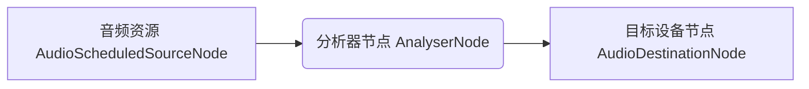
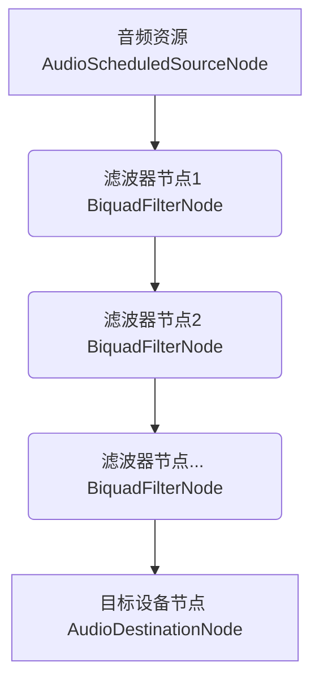
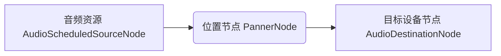
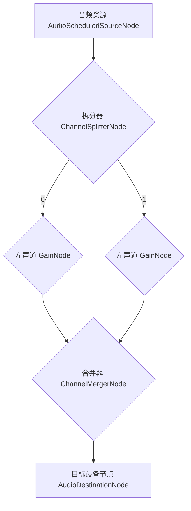

# <a id="AudioContext ">AudioContext </a>音频上下文接口

T6_ 属性

|属性名|类型|描述|
|---|---|---|
|baseLatency |number|只读， 返回[AudioContext](#AudioContext)将音频从[AudioDestinationNode](#AudioDestinationNode)传递到音频子系统的处理延迟的秒数。|
|outputLatency |number|只读， 返回对当前音频上下文的预估输出延迟。|

T6_ 方法

|方法|描述|
|---|---|
|createMediaElementSource(MediaElement): [MediaElementAudioSourceNode](#MediaElementAudioSourceNode)|通过Video 或者 Audio 关联音频资源|
|createMediaStreamSource(stream: MediaStream): [MediaStreamAudioSourceNode](#MediaStreamAudioSourceNode)|通过 媒体流 MediaStream 关联音频资源|
|createMediaStreamDestination(): [MediaStreamAudioDestinationNode](#MediaStreamAudioDestinationNode)|用于创建一个新的对象，该对象关联着表示音频流的一个 WebRTC MediaStream ,音频流可以存储在本地文件或者被发送到另外一台计算机.|
|createMediaStreamTrackSource(): [MediaStreamTrackAudioSourceNode](#MediaStreamTrackAudioSourceNode)|创建一个MediaStreamTrackAudioSourceNode，它与一个MediaStream相关联，表示一个媒体流轨迹。|
|close()|关闭一个音频环境, 释放任何正在使用系统资源的音频。|
|resume()|恢复之前暂停播放的音频|
|suspend()|暂停音频上下文对象中的进度|

## MediaStream

## 相关字典
### AudioNodeOptions
T6_ AudioNodeOptions 字段

|参数|是否必填|描述|
|---|---|---|
|channelCount|-|输出通道数， 具体用法取决于channelCountMode|
|[channelCountMode](#channelCountMode)| - |通道计数模式|
|[channelInterpretation](#channelInterpretation)| - |通道解读模式|

### AudioContextOptions
T6_ AudioNodeOptions 字段

|参数|是否必填|描述|
|---|---|---|
|latencyHint|-|延迟提示，balanced/interactive/playback|
|sampleRate| - |采样率|

T6_ latencyHint

|参数|描述|
|---|---|
|balanced|选择等待时间值时，用户代理应平衡音频输出等待时间和功耗|
|interactive|音频包含在交互元素中，例如响应用户动作或需要与视觉提示（例如视频或游戏动作）一致。 用户代理应选择不会引起音频故障的最低延迟。 这可能需要增加功耗。 这是默认值。|
|playback|用户代理应选择一个延迟，该延迟将通过以最小化功耗为代价来最大程度地延长回放时间，但以延迟为代价。 用于非交互式播放，例如播放音乐。|

 

## 基础节点
### <a id="EventTarget">EventTarget</a> 事件节点
T6_ 方法

|方法|描述|
|---|---|
|addEventListener|注册事件监听|
|removeEventListener|删除事件监听|
|dispatchEvent|出发事件|

### <a id="AudioNode">AudioNode</a> 音频基础节点
抽象类？ 一个处理音频的通用模块

T6_ 属性

|属性名|类型|描述|
|---|---|---|
|context|AudioContext|音频上下文|
|numberOfInputs |unsigned long|输入接口数|
|numberOfOutputs |number|输出接口数|
|channelCount|number|输出通道数， 具体用法取决于[channelCountMode](#channelCountMode_)|
|<a id="channelCountMode_">[channelCountMode](#channelCountMode)</a>| max clamped-max explicit |通道计数模式 定义了输入与输出通道之间的映射关系|
|[channelInterpretation](#channelInterpretation)| Mono Stereo Quad 5.1 |通道解读模式|

T6_ 方法

|方法名|描述|
|---|---|
|connect(device?: AudioNode,input?:int,output?:int)|连接设备|
|disconnect|断开连接|

T6_ connect 参数

|参数|类型|描述|
|---|---|---|
|device|AudioNode/AudioParam|连接到的设备|
|input|int|目标设备输入通道（也有可能笔者将input 和 output 搞反了）|
|output|int|当前设备输入通道（也有可能笔者将input 和 output 搞反了）|

T6_ 上混和下混

|名称||描述|
|---|---|
|上混|尽可能保留通道信息，一一对应，不足的静音|
|下混|只保存指定数量的通道，一一对应，超出丢弃|

T6_ <a id="channelCountMode">channelCountMode</a> 通道计数模式

|值|描述|
|---|---|
|max|通道数是所有连接的最大通道数。 这意味着channelCount被忽略，仅发生上混, （和输入保持一致？）|
|clamped-max|通道数是所有连接的最大通道数，固定为channelCount的值。|
|explicit|通道数由channelCount定义|

T6_ <a id="channelInterpretation">channelInterpretation</a> 通道转换模式

|值|描述|
|---|---|
|speakers|扬声器|
|discrete|离散|

T6_ 声道名称

|值|缩写|描述|
|---|---|---|
|mono|M|单声道|
|left|L|左声道|
|right|R|右声道|
|surround left|SL|环绕左声道|
|surround right|SR|环绕右声道|
|center|C|中置声道|
|subwoofer|LFE|低音炮|

T6_ 声道类型

|值|名称|通道数量|描述|
|---|---|---|---|
|Mono|单声道|1|0:mono|
|Stereo|立体声|2|0: L 1: R|
|Quad|环绕声|4|0: L 1: R 2: SL 3: SR|
|5.1|5.1声道|6|0: L 1: R 2: C 3: LFE 4: SL 5: SR|

T6_ speakers 扬声器转换模式

|输入|输出|混合规则|
|---|---|---|
|Mono|Stereo|L:M R:M|
|Mono|Quad|L:M R:M SL:0 SR:0|
|Mono|5.1|L:0 R:0 C:M LEF:0 SL:0 SR:0|
|Stereo|Mono|M:0.5 * (L + R)|
|Stereo|Quad|L:L R:R SL:0 SR:0|
|Stereo|5.1|L:L R:R C:0 LEF:0 SL:0 SR:0|
|Quad|Mono|M:0.25 * (L + R + SL +SR)|
|Quad|Stereo|L:0.5 * (L + SL) R:0.5*(R + SR)|
|Quad|5.1|L:L R:R C:0 LEF:0 SL:SL SR:SR|
|5.1|Mono|M:0.7071 * (L + R) + C + 0.5 * (SL + SR)|
|5.1|Stereo|L:L + 0.7071 * (C + SL) R:R + 0.7071 * (C + SR)|
|5.1|Quad|L:L + 0.7071 * C R:R + 0.7071 * C SL:SL SR:SR|

T6_ discrete 离散转换模式

|输入|输出|关系|描述|
|---|---|---|---|
|x|y|x < y|上混|
|x|y|x > y|下混|

### <a id="">AudioParam</a> 音频参数节点
继承 [AudioNode](#AudioNode) 该节点内部维护了一个事件列表，用于控制 AudioParam.value，由 audioContext.currentTime 触发（事件的列表允许我们去有计划地进行必须在非常精确的时间发生的更改，使用任意的基于时间轴的自动化曲线）。
该列表初始为空， 当不为空时，对 AudioParam.value 的赋值将被忽略。
后文将该列表内的项称为关键帧（用于描述某时刻 AudioParam.value的值， 以及各关键帧之间 AudioParam.value 如何变化）。
AudioParam 提供了一组方法来操作这个列表（设置关键帧）。

T6_ 属性

|属性名|类型|描述|
|---|---|---|
|defaultValue|number|默认值|
|maxValue |number|最大值|
|minValue |number|最小值|
|value |number|实际值|

T6_ 方法

|方法名|描述|
|---|---|
|setValueAtTime(value, startTime)|设置普通关键帧|
|linearRampToValueAtTime(value, endTime)|设置线性关键帧， 从上一个关键帧开始， 到endTime结束|
|setValueCurveAtTime(target, startTime, duration)|设置线性关键帧， 从startTime开始， 经过duration后结束|
|exponentialRampToValueAtTime(value, endTime)|设置指数关键帧， 从上一个关键帧开始， 到endTime结束|
|setTargetAtTime(target, startTime,duration)|设置指数关键帧， 从startTime开始， 经过duration后结束|
|cancelScheduledValues(startTime)|删除指定时间点后面的关键帧（当处于变化）|
|cancelAndHoldAtTime(cancelTime)|删除指定时间点后面的关键帧，并保持删除时的数值|

### <a id="AudioScheduledSourceNode ">AudioScheduledSourceNode </a>音源节点基类
继承 [AudioNode](#AudioNode) 被其他音源节点继承， 未播放时或播放结束后将处于静默状态。

T6_ 事件

|事件名|描述|
|---|---|
|onended|当播放结束时触发|

T6_ 方法

|方法名|描述|
|---|---|
|start()|开始播放|
|stop()|结束播放|

### <a>BaseAudioContext</a> 基础音频上下文

T6_ 属性

|属性名|类型|描述|
|---|---|---|
|audioWorklet |[AudioWorklet](#AudioWorklet)|工作台|
|currentTime |number|只读，当前播放时间|
|destination |[AudioDestinationNode](AudioDestinationNode)|目标节点（一般指扬声器）|
|listener |[AudioListener](#AudioListener)|聆听者，定义三维空间中，'destination'所在位置|
|sampleRate |number|采样率|
|state |number|状态|

T6_ 事件

|事件名|描述|
|---|---|
|onstatechange|状态改变时触发， suspend/resume/close|

T6_ 方法

|方法|描述|
|---|---|
|createAnalyser(): [AnalyserNode](#AnalyserNode)|创建分析器|
|createBiquadFilter():[BiquadFilterNode](#BiquadFilterNode)|创建滤波器|
|createBuffer():[AudioBuffer](#AudioBuffer)|创建空的 [AudioBuffer](#AudioBuffer) 对象， 可填充数据用 AudioBufferSourceNode 播放|
|createBufferSource():[AudioBufferSourceNode](#AudioBufferSourceNode)|创建 AudioBufferSourceNode 对象。可以比播放 buffer([AudioBuffer](#AudioBuffer)) 里面的数据（也可以是 [AudioContext.decodeAudioData()]()的返回值） |
|createConstantSource(): [ConstantSourceNode](#ConstantSourceNode)|--|
|createChannelSplitter(): [ChannelSplitterNode](#ChannelSplitterNode)|创建拆分器|
|createConvolver(): [ConvolverNode](#ConvolverNode)|--|
|createDelay(): [DelayNode](#DelayNode)|--|
|createDynamicsCompressor(): [DynamicsCompressorNode](#DynamicsCompressorNode)|--|
|createGain(): [GainNode](#GainNode)|--|
|createIIRFilter(): [IIRFilterNode](#IIRFilterNode)|--|
|createOscillator(): [OscillatorNode](#OscillatorNode)|--|
|createPanner(): [PannerNode](#PannerNode)|--|
|createPeriodicWave(): [PeriodicWave](#PeriodicWave)|--|
|createWaveShaper(): [WaveShaperNode](#WaveShaperNode)|--|
|decodeAudioData(source, successCallback:([ArrayBuffer](#ArrayBuffer)), failCallback): [StereoPannerNode](#StereoPannerNode)|解码音频|

## 特殊节点

### <a id="AudioListener">AudioListener</a> 聆听者
这个节点不存在流程图中，可以通过 [BaseAudioContext.listener](#AudioListener) 访问 （[AudioContext](#AudioContext )继承了 [BaseAudioContext](#BaseAudioContext)）；
一个音频上下文中只有一个聆听者；它模拟了用户位于空间坐标系的位置。 与 PannerNodes 搭配使用可以制作环绕音效。

与 [PannerNode](#PannerNode) 类似， 聆听者在坐标系中具有方向和位置。
由于聆听者具有'双耳'，所以需要两组向量来表示方向：前面和上边。
假如我们定义x轴正方向为前方， z轴正方向为上方，聆听者位于原点O，则y轴正方向为坐标， 负方向为右边。

T6_ 属性

|属性名|类型|描述|
|---|---|---|
|positionX|number|位置X|
|positionY|number|位置Y|
|positionZ|number|位置Z|
|forwardX|number|面向X|
|forwardY|number|面向Y|
|forwardZ|number|面向Z|
|upX|number|头顶方向X|
|upY|number|头顶方向Y|
|upZ|number|头顶方向Z|

T6_ 方法

|方法名|描述|
|---|---|
|setOrientation(forwardX, forwardY, forwardZ, upX, upY, upZ)|设定聆听者的朝向(不推荐使用)|
|setPosition(x, y, y)|设定聆听者的位置|

## 流程图节点
表示一段音频资源到播放设备之间需要连接的其他设备， 可以用来控制/修改输出最终的输出。
具体应用如：
* 音频可视化 [流程图](#flow_audio_vis)
* 均衡器 [流程图](#flow_audio_balance)
* 环绕音效 [流程图](#flow_audio_surround)
* 自制立体音效 [流程图](#flow_audio_stereo)

T6_ <a id="flow_audio_vis">音频可视化流程</a>

T6_ <a id="flow_audio_balance">均衡器流程</a>

T6_ <a id="flow_audio_surround">环绕音效流程</a>

T6_ <a id='flow_audio_stereo'>自制立体音效流程</a>

### GainNode 音量增益节点
继承 [AudioNode](#AudioNode) 用于调整音量增益/衰减的节点

T6_ [AudioNode](#AudioNode)属性

|属性名|描述|值|
|---|---|---|
|numberOfInputs |输入接口数|1|
|numberOfOutputs |输出接口数|1|
|channelCount|输出通道数|2|
|[channelCountMode](#channelCountMode)|通道计数模式|max|
|[channelInterpretation](#channelInterpretation)|通道解读模式|speakers|

T6_ 属性

|属性名|类型|描述|
|---|---|---|
|gain|a-rate AudioParam|音量增益率|

### <a id="AnalyserNode">AnalyserNode</a> 分析器节点
继承 [AudioNode](#AudioNode) 这是一个不对音频流做任何改动的节点；
可以根据提供的方法获取时域或者频域信息， 从而创建音频可视化。

T6_ [AudioNode](#AudioNode)属性

|属性名|描述|值|
|---|---|---|
|numberOfInputs |输入接口数|1|
|numberOfOutputs |输出接口数|1|
|channelCount|输出通道数|1|
|[channelCountMode](#channelCountMode)|通道计数模式|explicit|
|[channelInterpretation](#channelInterpretation)|通道解读模式|speakers|

T6_ 属性

|属性名|类型|描述|
|---|---|---|
|fftSize|unsigned long|代表了用于计算频域信号时使用的 FFT (快速傅里叶变换) 的窗口大小。|
|frequencyBinCount|unsigned long|2的n次方, 值为fftSize的一半。这通常等于将要用于可视化的数据值的数量。|
|minDecibels|number|获取频域数据时的最小值|
|maxDecibels|number|获取频域数据时的最大值|
|smoothingTimeConstant|number|表示最后一个分析帧的平均常数 — 基本上，它随时间使值之间的过渡更平滑。|

T6_ 方法

|方法名|描述|
|---|---|
|getFloatFrequencyData(container: Float32Array)|将频域数据拷贝到指定容器|
|getByteFrequencyData(container: Unit8Array)|将频域数据拷贝到指定容器|
|getFloatTimeDomainData(container: Float32Array)|将时域数据拷贝到指定容器|
|getByteTimeDomainData(container: Unit8Array)|将时域数据拷贝到指定容器|

### <a id="AudioDestinationNode">AudioDestinationNode</a> 目标节点
继承 [AudioNode](#AudioNode) 目标节点， 一般为扬声器

T6_ [AudioNode](#AudioNode)属性

|属性名|描述|值|
|---|---|---|
|numberOfInputs |输入接口数|1|
|numberOfOutputs |输出接口数|0|
|channelCount|输出通道数|2|
|[channelCountMode](#channelCountMode)|通道计数模式|explicit|
|[channelInterpretation](#channelInterpretation)|通道解读模式|speakers|

T6_ 属性

|属性名|类型|描述|
|---|---|---|
|maxChannelCount|unsigned long|物理设备可处理的最大声道数量|

### <a id="BiquadFilterNode">BiquadFilterNode</a> 简单低阶滤波器
继承 [AudioNode](#AudioNode) 这是一个不对音频流做任何改动的节点；
可以根据提供的方法获取时域或者频域信息， 从而创建音频可视化。

T6_ [AudioNode](#AudioNode)属性

|属性名|描述|值|
|---|---|---|
|numberOfInputs |输入接口数|1|
|numberOfOutputs |输出接口数|1|
|channelCount|输出通道数|2|
|[channelCountMode](#channelCountMode)|通道计数模式|max|
|[channelInterpretation](#channelInterpretation)|通道解读模式|speakers|

T6_ 属性

|属性名|类型|描述|
|---|---|---|
|frequency|AudioParam|频率（Hz）|
|detune|AudioParam|失谐|
|Q|AudioParam|品质|
|gain|AudioParam|获取频域数据时的最大值|
|type|number|过滤算法|

T6_ 过滤算法

|name|type|frequency|Q|gain|Description|
|---|---|---|---|---|---|
|低通|lowpass|截止频率|指示频率在截止频率附近达到峰值的程度。 值越大，峰越大。|-|低于截止频率的频率通过， 高于的被衰减|
|高通|highpass|截止频率|指示频率在截止频率附近达到峰值的程度。 值越大，峰越大。|-|高于截止频率的频率通过， 低于的被衰减|
|带通|bandpass|中心频率|控制频段的宽度。 Q值越大，频带越小。|-|频带内的频率通过， 外部的被衰减|
|缺口|notch|中心频率|控制频段的宽度。 Q值越大，频带越小。|-|频带内的频率被衰减， 外部的通过|
|低架|lowshelf|截止频率|-|增幅或衰减（db）|低于截止频率的被衰减或增幅， 高于的不变|
|高架|highshelf|截止频率|-|增幅或衰减（db）|高于截止频率的被衰减或增强， 低于的不变|
|顶峰|peaking|中心频率|控制频段的宽度。 Q值越大，频带越小。|增幅或衰减（db）|频带内的频率被衰减或增强， 外部的不变|
|全通|allpass|中心频率|控制中频处的过渡程度。 此参数越大，过渡越尖锐和越大。|-|全部通过但是会改变相位关系|

T6_ 方法

|方法名|描述|
|---|---|
|getFrequencyResponse(frequencyArray: Float32Array, magResponseOutput: Float32Array, phaseResponseOutput: Float32Array)|为指定频率数组中指定的频率计算频率响应|

### <a id="ChannelMergerNode">ChannelMergerNode</a> 合成器节点
继承 [AudioNode](#AudioNode) 将多个输入合成一个输出的节点；
每个输入均对应输出的一个通道

T6_ [AudioNode](#AudioNode)属性

|属性名|描述|值|
|---|---|---|
|numberOfInputs |输入接口数|6|
|numberOfOutputs |输出接口数|1|
|channelCount|输出通道数|2|
|[channelCountMode](#channelCountMode)|通道计数模式|max|
|[channelInterpretation](#channelInterpretation)|通道解读模式|speakers|

### <a id="DelayNode">DelayNode</a> 延迟节点
继承 [AudioNode](#AudioNode) 将输入延迟一定时间后输出的节点。

T6_ [AudioNode](#AudioNode)属性

|属性名|描述|值|
|---|---|---|
|numberOfInputs |输入接口数|1|
|numberOfOutputs |输出接口数|1|
|channelCount|输出通道数|2|
|[channelCountMode](#channelCountMode)|通道计数模式|max|
|[channelInterpretation](#channelInterpretation)|通道解读模式|speakers|

T6_ 属性

|属性名|类型|描述|
|---|---|---|
|delayTime|AudioParam|延迟时间(s)|

### <a id="PannerNode">PannerNode</a> 平移节点？音源位置
继承 [AudioNode](#AudioNode) 表示音源信号在空间坐标系的方向及位置。
声音沿远离音源的方向逐渐减小。
沿声音方向画线l，p为 Ol 上某点,
以音源位置O为圆心， 以Op为半径画球,
在球面上离p点球面一定距离范围（弧pq）内， 音量不变，
在球面上离p点球面一定距离范围（弧pq）外至另一定距离范围（弧pr）内， 音量渐渐减小， 在这距离外的音量不再较小，
角qop: 内圆锥角度， 角por: 外圆锥角度（文档上时 圆锥内角度， 和圆锥外角度， 本人觉得内圆锥角度， 外圆锥角度较为合适）；

T6_ [AudioNode](#AudioNode)属性

|属性名|描述|值|
|---|---|---|
|numberOfInputs |输入接口数|1|
|numberOfOutputs |输出接口数|1|
|channelCount|输出通道数|2|
|[channelCountMode](#channelCountMode)|通道计数模式|clamped-max|
|[channelInterpretation](#channelInterpretation)|通道解读模式|speakers|

T6_ 属性

|属性名|类型|描述|
|---|---|---|
|coneInnerAngle|number|内圆锥角度(deg)|
|coneOuterAngle|number|外圆锥角度(deg)|
|coneOuterGain|number|外圆锥面及外圆锥外的音量最大音量（仍旧会随声音方向的距离减小）|
|panningModel|number|用于确定要使用哪种空间化算法将音频定位在3D空间中。|
|distanceModel|linear inverse exponential|距离模型， 定义音量随距离变化的算法|
|maxDistance|number|最大距离， 距离外声音不在减小|
|refDistance|number|参考距离。|
|rolloffFactor|number|滚降系数。|
|positionX|number|位置X|
|positionY|number|位置Y|
|positionZ|number|位置Z|
|orientationX|number|面向X|
|orientationY|number|面向Y|
|orientationZ|number|面向Z|

T6_ 方法

|方法名|描述|
|---|---|
|setOrientation(orientationX, orientationY, orientationZ)|设定音源的朝向(不推荐使用)|
|setPosition(x, y, y)|设定音源的位置|

### <a id="WaveShaperNode">WaveShaperNode</a> 波形整形节点
继承 [AudioNode](#AudioNode)

T6_ [AudioNode](#AudioNode)属性

|属性名|描述|值|
|---|---|---|
|numberOfInputs |输入接口数|1|
|numberOfOutputs |输出接口数|1|
|channelCount|输出通道数|2|
|[channelCountMode](#channelCountMode)|通道计数模式|max|
|[channelInterpretation](#channelInterpretation)|通道解读模式|speakers|

T6_ 属性

|属性名|类型|描述|
|---|---|---|
|curve|Float32Array|整形曲线|
|oversample|enumerated|过采样类型|

T6_ 方法

|方法名|描述|
|---|---|
|---|---|

### <a id="OscillatorNode">OscillatorNode</a> 振荡器节点
继承 [AudioNode](#AudioNode)

T6_ [AudioNode](#AudioNode)属性

|属性名|描述|值|
|---|---|---|
|numberOfInputs |输入接口数|0|
|numberOfOutputs |输出接口数|1|
|channelCount|输出通道数|2|
|[channelCountMode](#channelCountMode)|通道计数模式|max|
|[channelInterpretation](#channelInterpretation)|通道解读模式|speakers|

T6_ 属性

|属性名|类型|描述|
|---|---|---|
|frequency|AudioParam|频率|
|detune|AudioParam|失谐|
|type|sine square sawtooth triangle custom|波形|

T6_ 事件

|事件名|描述|
|---|---|
|onended|结束|

T6_ 方法

|方法名|描述|
|---|---|
|setPeriodicWave(wave: PeriodicWave)|设定聆听者的朝向(不推荐使用)|

### <a id="DynamicsCompressorNode">DynamicsCompressorNode</a> 压缩节点
继承 [AudioNode](#AudioNode) 动态压缩器节点接口提供压缩效果，可降低信号最响亮部分的音量，以帮助防止在同时播放和多路复用声音时发生削波和失真。 这通常用于音乐作品和游戏音频中。 DynamicsCompressorNode是一个AudioNode，它具有一个输入和一个输出。

T6_ [AudioNode](#AudioNode)属性

|属性名|描述|值|
|---|---|---|
|numberOfInputs |输入接口数|1|
|numberOfOutputs |输出接口数|1|
|channelCount|输出通道数|2|
|[channelCountMode](#channelCountMode)|通道计数模式|clamped-max|
|[channelInterpretation](#channelInterpretation)|通道解读模式|speakers|

T6_ 属性

|属性名|类型|描述|
|---|---|---|
|threshold|AudioParam|压缩开始分贝|
|knee|AudioParam|压缩过渡范围|
|ratio|AudioParam|变化比例|
|reduction|number|压缩量|
|attack|AudioParam|较小10db所需时间s|
|attack|AudioParam|增加10db所需时间s|

### <a id="ConvolverNode">ConvolverNode</a> 卷积节点
继承 [AudioNode](#AudioNode) 在给定的AudioBuffer上执行线性卷积，通常用于实现混响效果。 一个ConvolverNode始终只有一个输入和一个输出。

T6_ [AudioNode](#AudioNode)属性

|属性名|描述|值|
|---|---|---|
|numberOfInputs |输入接口数|0|
|numberOfOutputs |输出接口数|1|
|channelCount|输出通道数|1 2 4|
|[channelCountMode](#channelCountMode)|通道计数模式|clamped-max|
|[channelInterpretation](#channelInterpretation)|通道解读模式|speakers|

T6_ 属性

|属性名|类型|描述|
|---|---|---|
|buffer|AudioBuffer|1,2,4 通道的AudioBuffer|
|normalize|boolean|控制设置缓冲区属性时是否通过等幂归一化来缩放缓冲区的脉冲响应。|

### 音源节点

#### <a id="AudioBufferSourceNode">AudioBufferSourceNode</a> 音乐节点基类
继承 [AudioScheduledSourceNode](#AudioScheduledSourceNode)被其他音源节点继承， 未播放时或播放结束后将处于静默状态。

T6_ [AudioNode](#AudioNode)属性

|属性名|描述|值|
|---|---|---|
|numberOfInputs |输入接口数|0|
|numberOfOutputs |输出接口数|1|
|channelCount|输出通道数|AudioBuffer 定义， 无buffer 时 1|

T6_ 属性

|属性名|类型|描述|
|---|---|---|
|buffer|AudioBuffer|要播放的音频|
|detune|AudioParam|失谐|
|loop|boolean|循环播放|
|loopStart|number|循环播放开始时间|
|loopEnd|number|循环播放停止时间|
|playbackRate|AudioParam|播放速率， 由于没有在输出上应用音高校正，因此可用于更改样本的音高。|

#### <a id="MediaElementAudioSourceNode">MediaElementAudioSourceNode</a> 媒体音频元素源节点

T6_ [AudioNode](#AudioNode)属性

|属性名|描述|值|
|---|---|---|
|numberOfInputs |输入接口数|0|
|numberOfOutputs |输出接口数|1|
|channelCount|输出通道数|HTMLMediaElement 确定|

T6_ 属性

|属性名|类型|描述|
|---|---|---|
|mediaElement|HTMLMediaElement|传入构造函数的媒体元素|

#### <a id="MediaStreamAudioSourceNode">MediaStreamAudioSourceNode</a> 媒体流音频源节点

T6_ [AudioNode](#AudioNode)属性

|属性名|描述|值|
|---|---|---|
|numberOfInputs |输入接口数|0|
|numberOfOutputs |输出接口数|1|
|channelCount|输出通道数|MediaStreamTrack 确定|

T6_ 属性

|属性名|类型|描述|
|---|---|---|
|mediaStream|[MediaStream](MediaStream)|传入构造函数的 MediaStream |

#### <a id="MediaStreamAudioDestinationNode">MediaStreamAudioDestinationNode</a> 媒体流音频目标节点

T6_ [AudioNode](#AudioNode)属性

|属性名|描述|值|
|---|---|---|
|numberOfInputs |输入接口数|1|
|numberOfOutputs |输出接口数|0|
|channelCount|输出通道数|2|
|[channelCountMode](#channelCountMode)|通道计数模式|explicit|
|[channelInterpretation](#channelInterpretation)|通道解读模式|speakers|

T6_ 属性

|属性名|类型|描述|
|---|---|---|
|stream|[MediaStream](MediaStream)|一个 [MediaStream](MediaStream)，其中包含单个[MediaStreamTrack](#MediaStreamTrack)，其类型为音频，并且具有与节点相同的通道数。 您可以使用此属性从音频图表中获取流，并将其馈送到另一个构造（例如Media Recorder）中。|

#### <a id="MediaStreamTrackAudioSourceNode">MediaStreamTrackAudioSourceNode</a> 媒体流轨道音频源节点

T6_ [AudioNode](#AudioNode)属性

|属性名|描述|值|
|---|---|---|
|numberOfInputs |输入接口数|1|
|numberOfOutputs |输出接口数|0|
|channelCount|输出通道数|创建时传入的 [MediaStreamTrack](#MediaStreamTrack)|

### [AudioBuffer ](#AudioBuffer)音频缓存
内存中的一小段音频资源

T6_ 属性

|属性名|类型|描述|
|---|---|---|
|sampleRate|number|采样率 sample / s|
|length|number|采样帧率|
|duration|number|资源时长|
|numberOfChannels|number|资源通道数量|

T6_ 方法

|方法名|描述|
|---|---|
|getChannelData(channel): Float32Array|获取指定通道的音频资源|
|copyFromChannel(destination: Float32Array,channelNumber: int,startInChannel?: int);|拷贝指定通道的音频资源|
|copyToChannel(source: Float32Array,channelNumber: int,startInChannel?: int);|将音频资源拷贝到指定通道|

### <a id="PeriodicWave">PeriodicWave</a> 周期波
无继承 new PeriodicWave(real: Float32Array, image: Float32Array, options: {disableNormalization: boolean})

T6_ 属性

|属性名|类型|描述|
|---|---|---|
|---|---|---|

T6_ 方法

|方法名|描述|
|---|---|
|---|---|

